# 邢善泽的工程笔记

# 9.21

编程组的人都是猪头 🐷 完善了我们的小车方案，并且将编程组最终的人选确认了一下。安装 AndroidSTUDIO 搞了一节课，诶，下次找时间给他们恶补知识。

# 10.1

学习调优 roadrunner 并完整调优一辆车。看了一个小时的视频，调整参数 KA KV KS 以及微调参数，学习使用 dashboard5.0。让后给新手李铭泽学习 Java 基础语法。就这么简单。

# 10.2

今天超级编程，学习如何编写颜色传感器，但是有点困难，我不是美术生，我也不知道啊？编写了基础的测试用的程序，包括磁力限位传感器，舵机和颜色传感器。了解看一些高阶 Java 语法（构造函数）也算是复习了，终于是回归正轨了。

# 10.3

学习使用 camera 识别 AirTag，找到了一个新的 dashboard 叫 panel，可以无线设置 limilight3A 太强了，但是它其它功能要用.kt 文件，放在主机里直接闪退用不了，所以还是不用其他功能了。

# 10.6

研究抛物线公式

判定式：

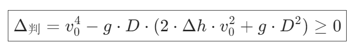

方程（化简后）

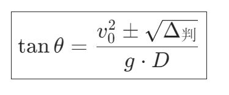

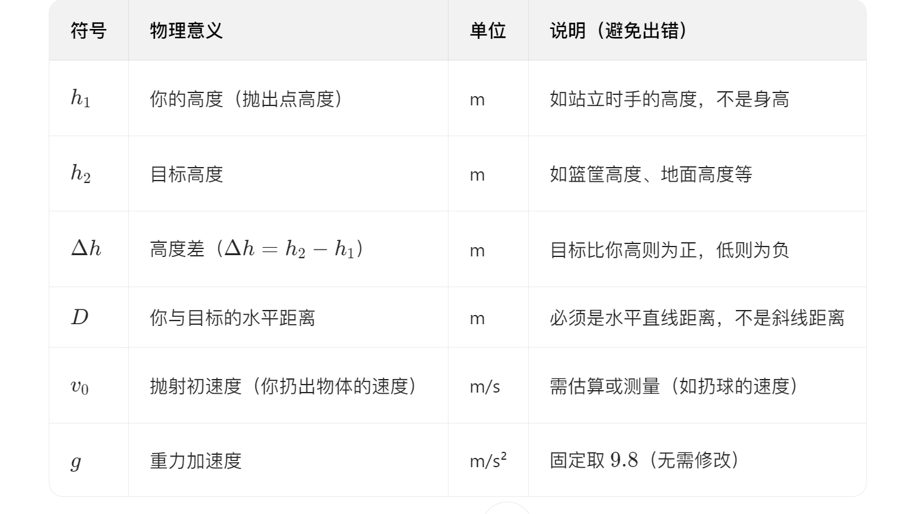

所以计算出来有两个解对应高抛和低抛

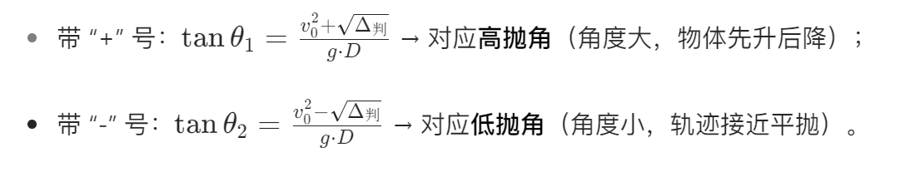

所以谁能告诉我速度和角度该咋去写？

```java
package org.firstinspires.ftc.teamcode.FTC_27650_new;


import com.acmerobotics.dashboard.FtcDashboard;
import com.acmerobotics.dashboard.config.Config;
import com.acmerobotics.dashboard.telemetry.MultipleTelemetry;
import com.qualcomm.robotcore.eventloop.opmode.LinearOpMode;
import com.qualcomm.robotcore.eventloop.opmode.TeleOp;

@TeleOp(name="parabola_test(抛物线)", group="Linear OpMode")
//@Disabled
@Config

public class parabola_test extends LinearOpMode {

    double power = 1;
    public static double h1 = 0.2;//车高unit:m
    public static double h2 = 1.1;//塔高unit:m
    public static double k = 15;//系数
    double v = (power * k);//速度（电机功率*系数k）unit:(m/s)
    double g = 9.8;//重力加速度unit:(m/s*s)
    public static double d = 1;//水平距离（h1与h2）unit:m


    public void runOpMode() {
        telemetry = new MultipleTelemetry(telemetry, FtcDashboard.getInstance().getTelemetry());

        waitForStart();

        while (opModeIsActive()) {

            double discriminant = (v * v * v * v) - g * d * (2 * v * v * (h2 - h1) + g * d); // 判别式

            if (discriminant >= 0) {
                double sqrtDiscriminant = Math.sqrt(discriminant);
                double tanTheta1 = ((v * v) + sqrtDiscriminant) / (g * d);//高抛角
                double tanTheta2 = ((v * v) - sqrtDiscriminant) / (g * d);//低抛角
                double theta1 = Math.atan(tanTheta1); // 弧度
                double theta2 = Math.atan(tanTheta2); // 弧度

                telemetry.addData("theta1 (弧度)", "%4.4f", Math.atan(theta1));
                telemetry.addData("theta2 (弧度)", "%4.4f", Math.atan(theta2));
                telemetry.addData("theta1 (角度,高抛角)", "%4.4f", Math.toDegrees(theta1));
                telemetry.addData("theta1 (角度,低抛角)", "%4.4f", Math.toDegrees(theta2));
                telemetry.addData("discriminant(判定式)", "%4.4f", discriminant);


            } else {
                telemetry.addData("discriminant(判定式无解)", "%4.4f", discriminant);
            }
            telemetry.update();


        }

    }
}
```

学习使用 LIMELIGHT 识别与 AirTag 的距离

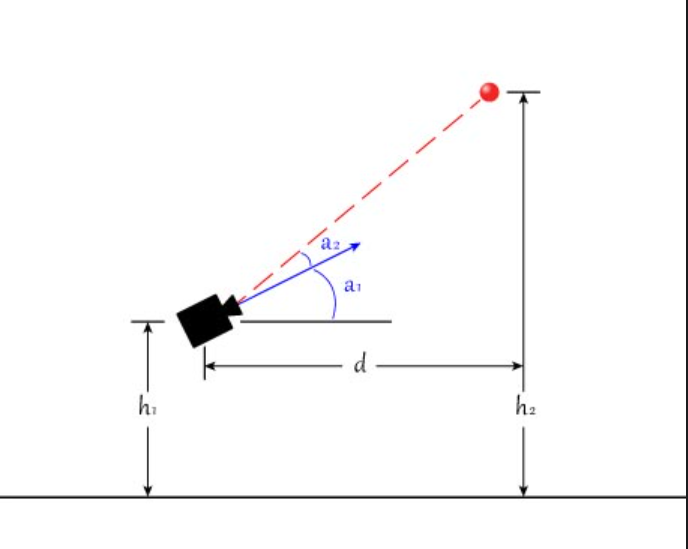

如图，我们可以得知计算公式为

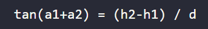

所以谁能告诉我相机角度和高度是多少呢?

程序：

```java
/*
Copyright (c) 2024 Limelight Vision

All rights reserved.

Redistribution and use in source and binary forms, with or without modification,
are permitted (subject to the limitations in the disclaimer below) provided that
the following conditions are met:

Redistributions of source code must retain the above copyright notice, this list
of conditions and the following disclaimer.

Redistributions in binary form must reproduce the above copyright notice, this
list of conditions and the following disclaimer in the documentation and/or
other materials provided with the distribution.

Neither the name of FIRST nor the names of its contributors may be used to
endorse or promote products derived from this software without specific prior
written permission.

NO EXPRESS OR IMPLIED LICENSES TO ANY PARTY'S PATENT RIGHTS ARE GRANTED BY THIS
LICENSE. THIS SOFTWARE IS PROVIDED BY THE COPYRIGHT HOLDERS AND CONTRIBUTORS
"AS IS" AND ANY EXPRESS OR IMPLIED WARRANTIES, INCLUDING, BUT NOT LIMITED TO,
THE IMPLIED WARRANTIES OF MERCHANTABILITY AND FITNESS FOR A PARTICULAR PURPOSE
ARE DISCLAIMED. IN NO EVENT SHALL THE COPYRIGHT OWNER OR CONTRIBUTORS BE LIABLE
FOR ANY DIRECT, INDIRECT, INCIDENTAL, SPECIAL, EXEMPLARY, OR CONSEQUENTIAL
DAMAGES (INCLUDING, BUT NOT LIMITED TO, PROCUREMENT OF SUBSTITUTE GOODS OR
SERVICES; LOSS OF USE, DATA, OR PROFITS; OR BUSINESS INTERRUPTION) HOWEVER
CAUSED AND ON ANY THEORY OF LIABILITY, WHETHER IN CONTRACT, STRICT LIABILITY, OR
TORT (INCLUDING NEGLIGENCE OR OTHERWISE) ARISING IN ANY WAY OUT OF THE USE OF
THIS SOFTWARE, EVEN IF ADVISED OF THE POSSIBILITY OF SUCH DAMAGE.
*/
package org.firstinspires.ftc.teamcode.FTC_27650_new;

import com.acmerobotics.dashboard.FtcDashboard;
import com.acmerobotics.dashboard.config.Config;
import com.acmerobotics.dashboard.telemetry.MultipleTelemetry;
import com.qualcomm.hardware.limelightvision.LLResult;
import com.qualcomm.hardware.limelightvision.LLResultTypes;
import com.qualcomm.hardware.limelightvision.LLStatus;
import com.qualcomm.hardware.limelightvision.Limelight3A;
import com.qualcomm.robotcore.eventloop.opmode.LinearOpMode;
import com.qualcomm.robotcore.eventloop.opmode.TeleOp;
import com.qualcomm.robotcore.hardware.DcMotorEx;

import org.firstinspires.ftc.robotcore.external.navigation.Pose3D;

import java.util.List;

/**
 * This OpMode illustrates how to use the Limelight3A Vision Sensor.
 *
 * @see <a href="https://limelightvision.io/">Limelight</a>
 *
 * Notes on configuration:
 *
 *   The device presents itself, when plugged into a USB port on a Control Hub as an ethernet
 *   interface.  A DHCP server running on the Limelight automatically assigns the Control Hub an
 *   ip address for the new ethernet interface.
 *
 *   Since the Limelight is plugged into a USB port, it will be listed on the top level configuration
 *   activity along with the Control Hub Portal and other USB devices such as webcams.  Typically
 *   serial numbers are displayed below the device's names.  In the case of the Limelight device, the
 *   Control Hub's assigned ip address for that ethernet interface is used as the "serial number".
 *
 *   Tapping the Limelight's name, transitions to a new screen where the user can rename the Limelight
 *   and specify the Limelight's ip address.  Users should take care not to confuse the ip address of
 *   the Limelight itself, which can be configured through the Limelight settings page via a web browser,
 *   and the ip address the Limelight device assigned the Control Hub and which is displayed in small text
 *   below the name of the Limelight on the top level configuration screen.
 */
@TeleOp(name = "Sensor: Limelight3A", group = "Sensor")
//@Disabled
@Config
public class SensorLimelight3A extends LinearOpMode {
    private static Limelight3A limelight;
    static LLResult result = limelight.getLatestResult();
    public static double targetOffsetAngle_Vertical = result.getTy();
    // 您的limelight从完全垂直方向向后旋转了多少度？
    public static double limelightMountAngleDegrees = 0;
    // Limelight镜头中心到地面的距离
    public static double limelightLensHeightInches = 0;//unit:in
    // 目标到地面的距离
    public static double goalHeightInches = 24.0;//unit:in


    @Override
    public void runOpMode() {
        limelight = hardwareMap.get(Limelight3A.class, "limelight");
        telemetry = new MultipleTelemetry(telemetry, FtcDashboard.getInstance().getTelemetry());


        telemetry.setMsTransmissionInterval(11);

        limelight.pipelineSwitch(0);

        /*
         * Starts polling for data.  If you neglect to call start(), getLatestResult() will return null.
         */
        limelight.start();

        telemetry.addData(">", "Robot Ready.  Press Play.");
        telemetry.update();
        DcMotorEx m0 = null;
        m0 = hardwareMap.get(DcMotorEx.class, "m0"); // c0


        waitForStart();

        while (opModeIsActive()) {
            if (gamepad1.a) {
                m0.setPower(1);
            }

            LLStatus status = limelight.getStatus();


            telemetry.addData("Name", "%s",
                    status.getName());
            telemetry.addData("LL", "Temp: %.1fC, CPU: %.1f%%, FPS: %d",
                    status.getTemp(), status.getCpu(), (int) status.getFps());
            telemetry.addData("Pipeline", "Index: %d, Type: %s",
                    status.getPipelineIndex(), status.getPipelineType());


            if (result.isValid()) {
                // Access general information
                Pose3D botpose = result.getBotpose();
                double captureLatency = result.getCaptureLatency();
                double targetingLatency = result.getTargetingLatency();
                double parseLatency = result.getParseLatency();
                //telemetry.addData("LL Latency", captureLatency + targetingLatency);
                //telemetry.addData("Parse Latency", parseLatency);
                //telemetry.addData("PythonOutput", java.util.Arrays.toString(result.getPythonOutput()));

                double angleToGoalDegrees = limelightMountAngleDegrees + targetOffsetAngle_Vertical;
                double angleToGoalRadians = angleToGoalDegrees * (3.14 / 180.0);
                //计算距离
                double distanceFromLimelightToGoalInches = (goalHeightInches - limelightLensHeightInches) / Math.tan(angleToGoalRadians);
                double Distance = (distanceFromLimelightToGoalInches * 0.0254);
                telemetry.addData("Distance (m)", Distance);
                telemetry.addData("tx", result.getTx());
                telemetry.addData("txnc", result.getTxNC());
                telemetry.addData("ty", result.getTy());
                telemetry.addData("tync", result.getTyNC());

                telemetry.addData("Botpose", botpose.toString());

                // Access barcode results
                List<LLResultTypes.BarcodeResult> barcodeResults = result.getBarcodeResults();
                for (LLResultTypes.BarcodeResult br : barcodeResults) {
                    telemetry.addData("Barcode", "Data: %s", br.getData());
                }

                // Access classifier results
                List<LLResultTypes.ClassifierResult> classifierResults = result.getClassifierResults();
                for (LLResultTypes.ClassifierResult cr : classifierResults) {
                    telemetry.addData("Classifier", "Class: %s, Confidence: %.2f", cr.getClassName(), cr.getConfidence());
                }

                // Access detector results
                List<LLResultTypes.DetectorResult> detectorResults = result.getDetectorResults();
                for (LLResultTypes.DetectorResult dr : detectorResults) {
                    telemetry.addData("Detector", "Class: %s, Area: %.2f", dr.getClassName(), dr.getTargetArea());
                }

                // Access fiducial results
                List<LLResultTypes.FiducialResult> fiducialResults = result.getFiducialResults();
                for (LLResultTypes.FiducialResult fr : fiducialResults) {
                    telemetry.addData("Fiducial", "ID: %d, Family: %s, X: %.2f, Y: %.2f", fr.getFiducialId(), fr.getFamily(), fr.getTargetXDegrees(), fr.getTargetYDegrees());
                }

                // Access color results
                List<LLResultTypes.ColorResult> colorResults = result.getColorResults();
                for (LLResultTypes.ColorResult cr : colorResults) {
                    telemetry.addData("Color", "X: %.2f, Y: %.2f", cr.getTargetXDegrees(), cr.getTargetYDegrees());
                }
            } else {
                telemetry.addData("Limelight", "No data available");
            }

            telemetry.update();
            // 计算距离


        }
        limelight.stop();
    }
}
```

学习如何删除李铭泽的工程笔记

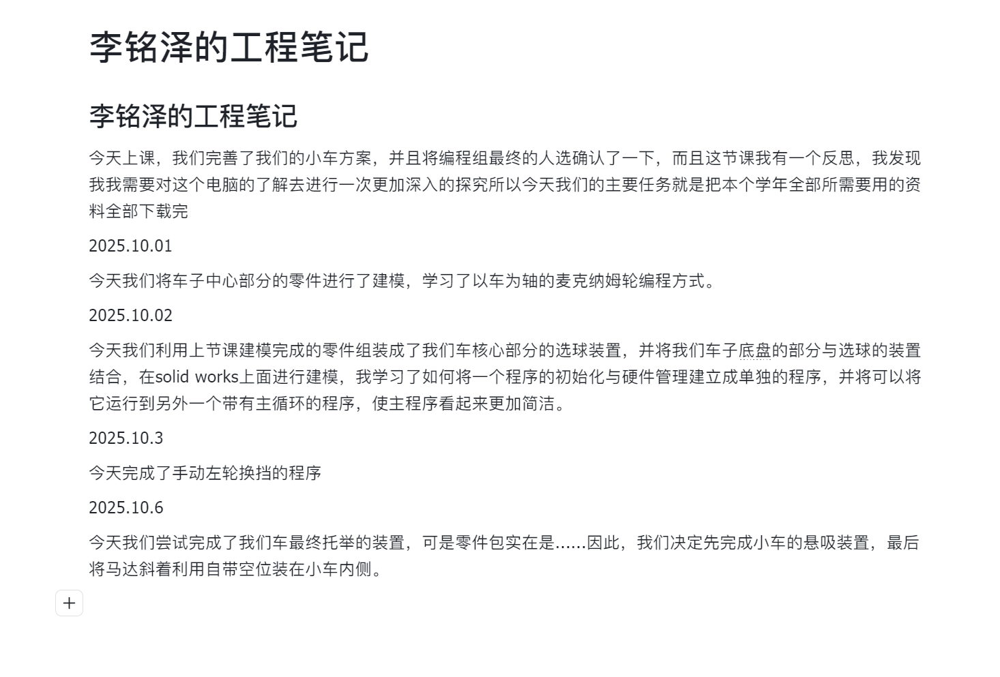

qwq（飞书竟然可以写公式！！！）

$$
\Delta_{\text{判}} = v_0^4 - g \cdot D \cdot \left( 2 \cdot \Delta h \cdot v_0^2 + g \cdot D^2 \right) \geq 0
$$

$$
\tan\theta = \frac{v_0^2 \pm \sqrt{\Delta_{\text{判}}}}{g \cdot D}
$$

还可以上传 Java 文件！！！

# 10.7

今日内容，研究了一上午为什么主机一下程序就无限重启的问题，下午测试了一些飞轮的方案加上把转轮的驱动器换成了电机，编了程。

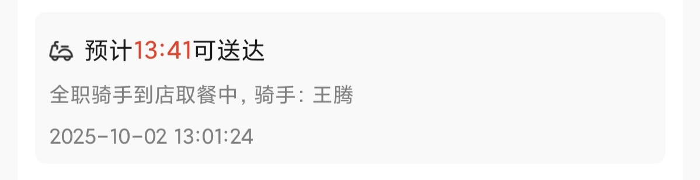

# 10.8

左轮结构的程序进一步优化算法，旋转驱动器由舵机转换为电机。运用编码器确定位置编程。

```java
while(opModeIsActive()){
    rotateMotorCurrentPosition = robot.rotateMotor.getCurrentPosition();
    if(gamepad2.b){
        while(gamepad2.b){
            if(!gamepad2.b){
                break;
            }
        }
        rotateMotorTargetPosition+=96;//(288/3);
    }
    rotateMotorPower =(rotateMotorTargetPosition-rotateMotorCurrentPosition)*0.01;
    if(0<rotateMotorPower && rotateMotorPower<=rotateMotorMinPower){
        rotateMotorPower = rotateMotorMinPower;
    }
    if(rotateMotorPower<0 && rotateMotorPower>=-rotateMotorMinPower){
        rotateMotorPower =- rotateMotorMinPower;
    }
    if(Math.abs(rotateMotorTargetPosition-rotateMotorCurrentPosition)<=5){
        rotateMotorPower = 0;
    }
    robot.rotateMotor.setPower(rotateMotorPower);
    telemetry.addData("旋转功率", "%4.2f",rotateMotorPower);
    telemetry.addData("旋转位置", "%7d",rotateMotorCurrentPosition);
    telemetry.addData("目标位置", "%7d",rotateMotorTargetPosition);
    telemetry.update();
```

首先，while(opModeIsActive()) 是一个主循环，确保代码在操作模式激活时持续运行。每次循环开始时，代码通过 robot.rotateMotor.getCurrentPosition() 获取当前电机的位置，并存储在 rotateMotorCurrentPosition 中。

接着，代码检查 gamepad2.b 按钮是否被按下。如果按下，进入一个嵌套的 while(gamepad2.b) 循环，确保在按钮释放之前不会继续执行其他逻辑。按钮释放后，目标位置 rotateMotorTargetPosition 增加 96（即 rotateMotorTargetPosition += 96），这可能对应于电机旋转的一个固定步长。

然后，代码计算目标位置与当前电机位置之间的差值，并乘以一个系数 0.01 来确定电机的功率：

```java
rotateMotorPower = (rotateMotorTargetPosition - rotateMotorCurrentPosition) * 0.01;
```

为了避免功率过小导致电机无法启动，代码设置了一个最小功率限制：

如果功率为正且小于等于 rotateMotorMinPower，将功率设置为 rotateMotorMinPower。

如果功率为负且绝对值小于等于 rotateMotorMinPower，将功率设置为 -rotateMotorMinPower。

此外，当目标位置与当前电机位置的差值小于或等于 5 时，功率被设置为 0，表示电机停止：

```java
if (Math.abs(rotateMotorTargetPosition - rotateMotorCurrentPosition) <= 5) {
    rotateMotorPower = 0;
}
```

最后，代码通过 robot.rotateMotor.setPower(rotateMotorPower) 将计算出的功率应用到电机，并通过 telemetry 输出当前功率、位置和目标位置的信息到遥控器屏幕，方便实时监控。

最后把他写成线程合并到主程序里

```java
package org.firstinspires.ftc.teamcode.FTC_27650_TeleOp;

import android.graphics.Color;

import com.acmerobotics.dashboard.config.Config;
import com.qualcomm.robotcore.eventloop.opmode.LinearOpMode;
import com.qualcomm.robotcore.eventloop.opmode.TeleOp;
import com.qualcomm.robotcore.hardware.DcMotor;
import com.qualcomm.robotcore.hardware.NormalizedRGBA;
import com.qualcomm.robotcore.util.ElapsedTime;


@TeleOp(name = "手动27650")
@Config

public class MecanumWheel extends LinearOpMode {
    public static double strikerServoSpeed = 0.0001;
    public static double greenMin = 152, greenMax = 185;
    public static double purpleMin = 225, purpleMax = 250;
    public static double rotatePowerStart = 0.2;
    public static double rotateMotorMinPower = 0.6;
    final float[] hsvValuesLeft = new float[3]; //左边色调
    final float[] hsvValuesRight = new float[3];//右边色调
    private final ElapsedTime runtime = new ElapsedTime();
    public String colorLeft = "无";
    public String colorRight = "无";
    MyRobotHardware_27650_TeleOp robot = new MyRobotHardware_27650_TeleOp(this);
    Mecanum_1Thread Mecanum_1Thread = new Mecanum_1Thread();
    inBallPrepareThread inBallPrepareThread = new inBallPrepareThread();
    outBallPrepareThread outBallPrepareThread = new outBallPrepareThread();
    //public static double rotateServoPosition = 0.5;//旋转模式舵机 0.5停止    0正着转   1反着转
    //public static double rotateServoSpeed = 0.5; //  0 - 0.5 舵机旋转变快
    double strikerServoPosition = 0.6;//角度舵机    0.5代表转到中间
    boolean servoUsing = true;
    float gain = 2;//颜色传感器增益值，要>=1
    boolean magnetic_out_bool = false;
    boolean magnetic_in_bool = false;

    int rotateMotorTargetPosition = 0;
    double rotateMotorPower = 0;
    int a = 1;
    int b = 1;
    double rotateMotorCurrentPosition = 0;
    final int step = 96;

    @Override
    public void runOpMode() {

        robot.init();
        rotateMotorCurrentPosition =robot.rotateMotor.getCurrentPosition();
        robot.strikerServo.setPosition(strikerServoPosition);
        sleep(200);

        while (!robot.magnetic_in.isPressed()) {
            robot.rotateMotor.setPower(rotatePowerStart);
        }
        robot.rotateMotor.setPower(0);

        robot.rotateMotor.setMode(DcMotor.RunMode.STOP_AND_RESET_ENCODER);
        robot.rotateMotor.setMode(DcMotor.RunMode.RUN_USING_ENCODER);

        waitForStart();
        Mecanum_1Thread.start();
        //inBallPrepareThread.start();
        while (opModeIsActive()) {
            rotateMotorCurrentPosition = robot.rotateMotor.getCurrentPosition();


            if (gamepad2.left_bumper) {
                while (gamepad2.left_bumper) {
                    if (!gamepad2.left_bumper) {
                        break;
                    }
                }
                inBallPrepareThread.start();


            }
            if (gamepad2.right_bumper) {
                while (gamepad2.right_bumper) {
                    if (!gamepad2.right_bumper) {
                        break;
                    }
                }
                outBallPrepareThread.start();

            }
            if (servoUsing) servoControl();
            colorSensor();
            show();
        }
    }

    public void show() {
        magnetic_out_bool = robot.magnetic_out.isPressed();
        magnetic_in_bool = robot.magnetic_in.isPressed();

        //telemetry.addData("前轮 左/右","%4.2f, %4.2f", robot.fl.getPower(),robot.fr.getPower());
        //telemetry.addData("后轮 左/右","%4.2f, %4.2f", robot.bl.getPower(),robot.br.getPower());
        //telemetry.addData("旋转舵机","%4.2f", rotateServoPosition);
        telemetry.addData("向上抬球", "%4.2f", strikerServoPosition);
        telemetry.addData("Gain", gain);
        telemetry.addData("色调 左/右", "%.3f, %.3f", hsvValuesLeft[0], hsvValuesRight[0]);
        telemetry.addData("球颜色 左/右", "%s, %s", colorLeft, colorRight);
        telemetry.addData("磁性限位开关 out/in", "%b, %b", magnetic_out_bool, magnetic_in_bool);
        telemetry.addData("旋转功率", "%4.2f", rotateMotorPower);
        telemetry.addData("旋转位置", "%7d", rotateMotorCurrentPosition);
        telemetry.addData("目标位置", "%7d", rotateMotorTargetPosition);
        telemetry.update();
    }

    public void servoControl() {
        if (gamepad2.dpad_up)
            strikerServoPosition = Math.min(strikerServoPosition + strikerServoSpeed, 1);
        if (gamepad2.dpad_down)
            strikerServoPosition = Math.max(strikerServoPosition - strikerServoSpeed, 0);

        if (gamepad2.y) strikerServoPosition = 0.3;  //一键抬升
        if (gamepad2.a) strikerServoPosition = 0.6;  //一键下降
/*
        if(strikerServoPosition == 0.6){
            if(gamepad2.x) rotateServoPosition = 0.5 - rotateServoSpeed;
            if(gamepad2.b) rotateServoPosition = 0.5 + rotateServoSpeed;
            if(!gamepad2.x && !gamepad2.b) rotateServoPosition = 0.5;
        }else rotateServoPosition = 0.5;

 */
        //robot.rotateServo.setPosition(rotateServoPosition);
        robot.strikerServo.setPosition(strikerServoPosition);
    }

    public void colorSensor() {
        if (gamepad1.a) gain += 0.005;
        else if (gamepad1.b && gain > 1) gain -= 0.005;
        robot.colorSensorLeft.setGain(gain);
        robot.colorSensorRight.setGain(gain);

        NormalizedRGBA colorsLeft = robot.colorSensorLeft.getNormalizedColors();
        NormalizedRGBA colorsRight = robot.colorSensorRight.getNormalizedColors();

        Color.colorToHSV(colorsLeft.toColor(), hsvValuesLeft);
        Color.colorToHSV(colorsRight.toColor(), hsvValuesRight);

        if (greenMin <= hsvValuesLeft[0] && hsvValuesLeft[0] <= greenMax) colorLeft = "green";
        else if (purpleMin <= hsvValuesLeft[0] && hsvValuesLeft[0] <= purpleMax)
            colorLeft = "purple";
        else colorLeft = "无";
        if (greenMin <= hsvValuesRight[0] && hsvValuesRight[0] <= greenMax) colorRight = "green";
        else if (purpleMin <= hsvValuesRight[0] && hsvValuesRight[0] <= purpleMax)
            colorRight = "purple";
        else colorRight = "无";
    }

    public class Mecanum_1Thread extends Thread {
        public void run() {
            while (opModeIsActive()) {
                double y = -gamepad1.left_stick_y;
                double x = gamepad1.left_stick_x;
                double rx = gamepad1.right_stick_x;

                double flPower = y + x + rx;
                double frPower = y - x - rx;
                double brPower = y + x - rx;
                double blPower = y - x + rx;

                robot.fl.setPower(flPower);
                robot.fr.setPower(frPower);
                robot.br.setPower(brPower);
                robot.bl.setPower(blPower);
            }
        }
    }

    public class inBallPrepareThread extends Thread {

        public void run() {

            strikerServoPosition = 0.6;  //一键下降
            robot.strikerServo.setPosition(strikerServoPosition);
            try {
                sleep(200);
            } catch (InterruptedException e) {
                throw new RuntimeException(e);
            }

            if (a == 1) {
                rotateMotorTargetPosition += step;//(288/3);
            }


            while (opModeIsActive()) {
                rotateMotorPower = (rotateMotorTargetPosition - rotateMotorCurrentPosition) * 0.01;

                if (0 < rotateMotorPower && rotateMotorPower <= rotateMotorMinPower) {
                    rotateMotorPower = rotateMotorMinPower;
                }
                if (rotateMotorPower < 0 && rotateMotorPower >= -rotateMotorMinPower) {
                    rotateMotorPower = -rotateMotorMinPower;
                }
                if (Math.abs(rotateMotorTargetPosition - rotateMotorCurrentPosition) <= 5) {

                    break;
                }

                robot.rotateMotor.setPower(rotateMotorPower);
            }
            rotateMotorPower = 0;

            robot.rotateMotor.setPower(rotateMotorPower);
            a = 1;
        }
    }

    public class outBallPrepareThread extends Thread {
        public void run() {

            strikerServoPosition = 0.6;  //一键下降
            robot.strikerServo.setPosition(strikerServoPosition);
            try {
                sleep(200);
            } catch (InterruptedException e) {
                throw new RuntimeException(e);
            }

            if (b == 1) {
                rotateMotorTargetPosition += step+20;//(288/3);
            }


            while (opModeIsActive()) {
                rotateMotorPower = (rotateMotorTargetPosition - rotateMotorCurrentPosition) * 0.01;

                if (0 < rotateMotorPower && rotateMotorPower <= rotateMotorMinPower) {
                    rotateMotorPower = rotateMotorMinPower;
                }
                if (rotateMotorPower < 0 && rotateMotorPower >= -rotateMotorMinPower) {
                    rotateMotorPower = -rotateMotorMinPower;
                }
                if (Math.abs(rotateMotorTargetPosition - rotateMotorCurrentPosition) <= 5) {

                    break;
                }

                robot.rotateMotor.setPower(rotateMotorPower);
            }
            rotateMotorPower = 0;

            robot.rotateMotor.setPower(rotateMotorPower);
            b = 1;
        }

    }

}
```

```java
package org.firstinspires.ftc.teamcode.FTC_27650_TeleOp;

import com.qualcomm.robotcore.eventloop.opmode.LinearOpMode;
import com.qualcomm.robotcore.hardware.DcMotor;
import com.qualcomm.robotcore.hardware.DcMotorEx;
import com.qualcomm.robotcore.hardware.DcMotorSimple;
import com.qualcomm.robotcore.hardware.NormalizedColorSensor;
import com.qualcomm.robotcore.hardware.Servo;
import com.qualcomm.robotcore.hardware.TouchSensor;

public class MyRobotHardware_27650_TeleOp {

    public DcMotorEx fl = null;
    public DcMotorEx fr = null;
    public DcMotorEx br = null;
    public DcMotorEx bl = null;

    public DcMotorEx rotateMotor = null;

    //public Servo rotateServo = null;
    public Servo strikerServo = null;

    public NormalizedColorSensor colorSensorLeft;
    public NormalizedColorSensor colorSensorRight;

    public TouchSensor magnetic_out;
    public TouchSensor magnetic_in;

    private LinearOpMode myOpMode = null;
    public MyRobotHardware_27650_TeleOp (LinearOpMode opmode) {
       myOpMode = opmode;
    }

    public void init(){
        //端口配置
        fl = myOpMode.hardwareMap.get(DcMotorEx.class,"fl");//c0
        fr = myOpMode.hardwareMap.get(DcMotorEx.class,"fr");//c1
        br = myOpMode.hardwareMap.get(DcMotorEx.class,"br");//c2
        bl = myOpMode.hardwareMap.get(DcMotorEx.class,"bl");//c3

        rotateMotor = myOpMode.hardwareMap.get(DcMotorEx.class,"rm");//e0

        //rotateServo = myOpMode.hardwareMap.get(Servo.class,"rs");//cs0
        strikerServo = myOpMode.hardwareMap.get(Servo.class,"ss");//cs1

        colorSensorLeft = myOpMode.hardwareMap.get(NormalizedColorSensor.class, "csl");//cI1
        colorSensorRight = myOpMode.hardwareMap.get(NormalizedColorSensor.class, "csr");//cI2

        magnetic_out = myOpMode.hardwareMap.get(TouchSensor.class,"mo");//cd0
        magnetic_in = myOpMode.hardwareMap.get(TouchSensor.class,"mi");//cd2

        //制动
        fl.setZeroPowerBehavior(DcMotor.ZeroPowerBehavior.BRAKE);
        fr.setZeroPowerBehavior(DcMotor.ZeroPowerBehavior.BRAKE);
        br.setZeroPowerBehavior(DcMotor.ZeroPowerBehavior.BRAKE);
        bl.setZeroPowerBehavior(DcMotor.ZeroPowerBehavior.BRAKE);

        rotateMotor.setZeroPowerBehavior(DcMotor.ZeroPowerBehavior.BRAKE);
        rotateMotor.setMode(DcMotor.RunMode.STOP_AND_RESET_ENCODER);
        rotateMotor.setMode(DcMotor.RunMode.RUN_USING_ENCODER);

        //马达方向
        fl.setDirection(DcMotorSimple.Direction.FORWARD);
        bl.setDirection(DcMotorSimple.Direction.FORWARD);
        fr.setDirection(DcMotorSimple.Direction.REVERSE);
        br.setDirection(DcMotorSimple.Direction.REVERSE);

        rotateMotor.setDirection(DcMotorSimple.Direction.REVERSE);

        //((SwitchableLight)colorSensorLeft).enableLight(true);
        //((SwitchableLight)colorSensorRight).enableLight(true);

    }

}
```

# 10.12

[王泽国的日志]第四点，测试各种飞轮发射装置，编写以转速为条件的伺服电机控制程序(Dc motor EX)。得出结论：单电机单飞轮装置的动力不足以将标本投入框中，双飞轮发射器的动力足够，角度合适。运用基于 iPhone 的角度测量仪精准测量角度，建议实装时用一个

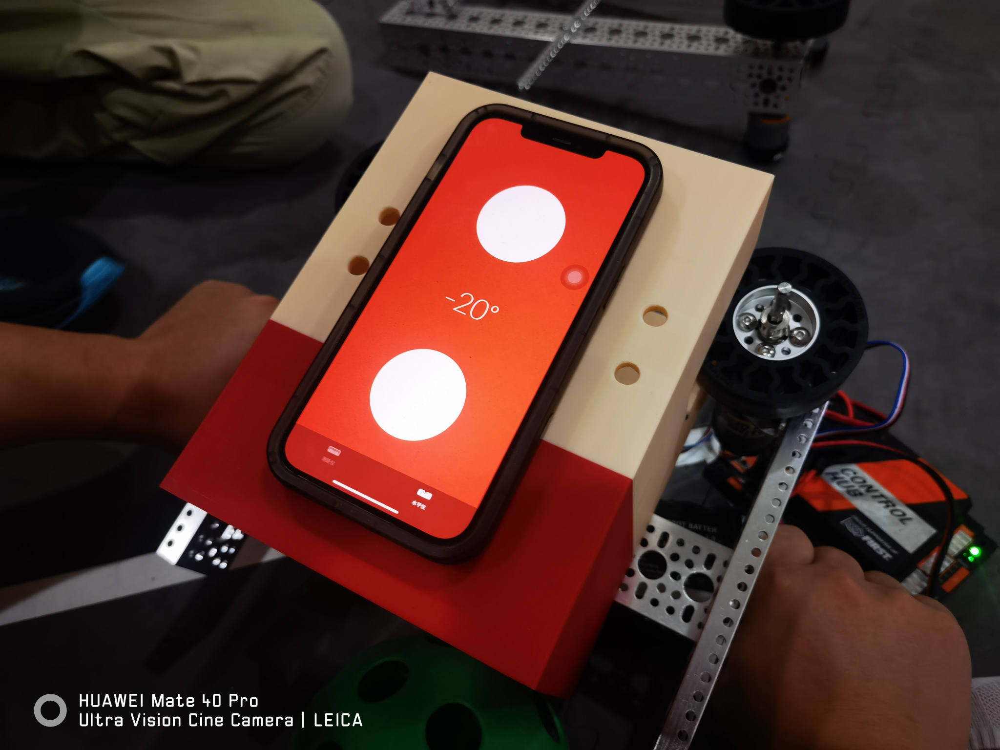

代码

```java
package org.firstinspires.ftc.teamcode.ftc27650_test;

import com.acmerobotics.dashboard.FtcDashboard;
import com.acmerobotics.dashboard.telemetry.MultipleTelemetry;
import com.qualcomm.robotcore.eventloop.opmode.LinearOpMode;
import com.qualcomm.robotcore.eventloop.opmode.TeleOp;
import com.qualcomm.robotcore.hardware.DcMotor;
import com.qualcomm.robotcore.hardware.DcMotorEx;

@TeleOp(name = "motor_test(电机测试)")
public class motor_test extends LinearOpMode {

    public DcMotorEx m0 = null;
    public DcMotorEx m1 = null;

    public void runOpMode() {
        telemetry = new MultipleTelemetry(telemetry, FtcDashboard.getInstance().getTelemetry());
        m0 = hardwareMap.get(DcMotorEx.class, "m0");
        m1 = hardwareMap.get(DcMotorEx.class, "m1");
        m0.setZeroPowerBehavior(DcMotorEx.ZeroPowerBehavior.BRAKE);
        m1.setZeroPowerBehavior(DcMotor.ZeroPowerBehavior.BRAKE);
        m0.setDirection(DcMotorEx.Direction.REVERSE);
        m1.setDirection(DcMotorEx.Direction.FORWARD);
        m0.setMode(DcMotorEx.RunMode.RUN_USING_ENCODER);
        m1.setMode(DcMotorEx.RunMode.RUN_USING_ENCODER);
        m0.setMode(DcMotorEx.RunMode.STOP_AND_RESET_ENCODER);
        m1.setMode(DcMotorEx.RunMode.STOP_AND_RESET_ENCODER);


        waitForStart();

        while (opModeIsActive()) {
            m0.setVelocity(5000);
            m1.setVelocity(5000);
            telemetry.addData("转速m0", m0.getVelocity());
            telemetry.addData("转速m1", m1.getVelocity());
            telemetry.update();
        }
    }
}
```

# 10.19

做了个死轮，花费一节课的时间，太浪费时间了。终于算是做好了

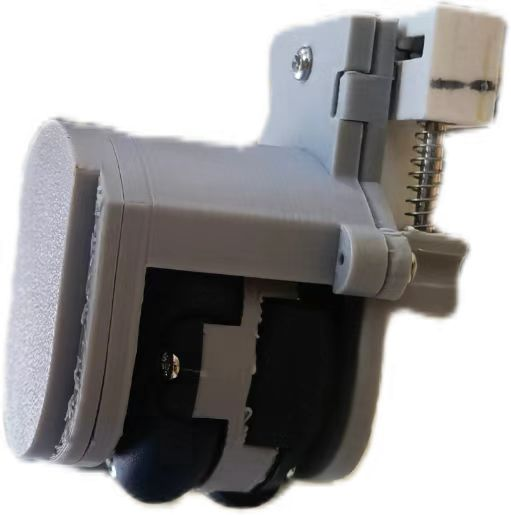

其实 Linux 安装 android studio 很好用，现在就在用

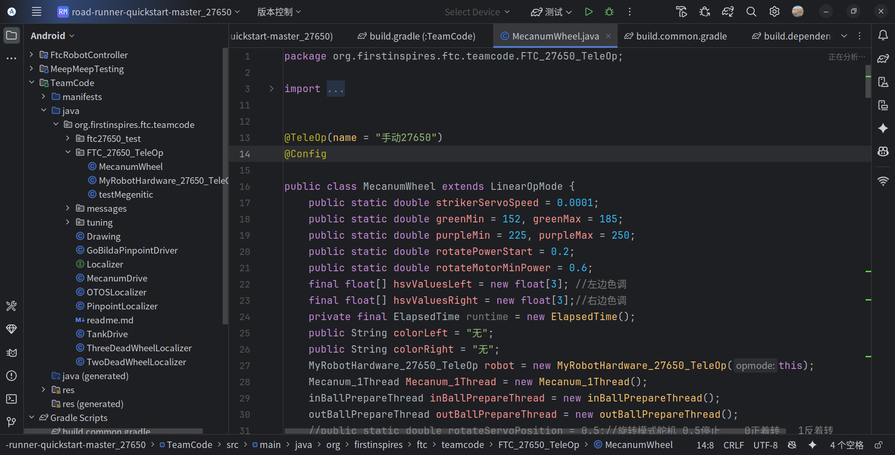

确定了侧板的材质，决定使用铝型材 cnc 切割侧板，任务交给了高天狗，复习了一下如何在 DDS 的装配体里画草图。

# 10.26

今天铝型材料，陶瓷轴承和 gobuilda 的死轮到了，安装花费一节课。Tips:gobuilda 的麦克纳姆轮滚轴只需要拆掉三个就可以了。

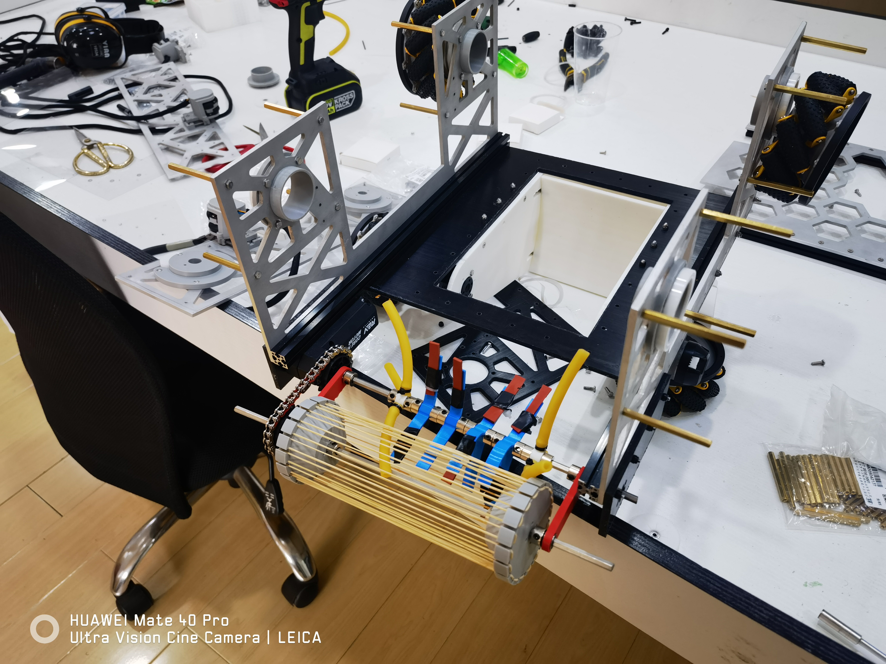
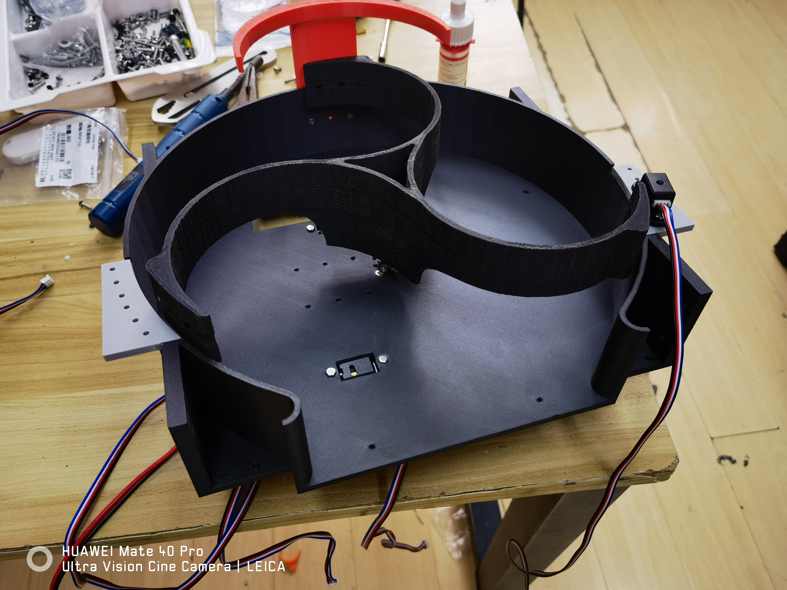
下次都不用带电脑来了 qwq。写个工笔还要凑字数，实在是今天写不到 100 字。

# 11.2

终于写上程序了......今天写了除左轮以及发射装置以外的所有程序（发射装置暂时只是一个马达速度，等于没写），今天一大早打开电脑发现 Android Studio 更新了，然后导入项目的时候报错 Cause: index == 7，以为是程序问题，最后观察日志发现是新版的**Android Studio 代理设置对话框 UI 渲染 Bug。**解决方案核心是「避免触发该对话框」或「修复对话框渲染环境」。也就是关闭代理。搞了我 15 分钟，我服了。

最新的代码如下：

```java
package org.firstinspires.ftc.teamcode.FTC_27650_TeleOp;

import android.graphics.Color;

import com.acmerobotics.dashboard.config.Config;
import com.qualcomm.robotcore.eventloop.opmode.LinearOpMode;
import com.qualcomm.robotcore.eventloop.opmode.TeleOp;
import com.qualcomm.robotcore.hardware.DcMotor;
import com.qualcomm.robotcore.hardware.NormalizedRGBA;
import com.qualcomm.robotcore.util.ElapsedTime;


@TeleOp(name = "手动27650")
@Config

public class MecanumWheel extends LinearOpMode {
    public static double strikerServoSpeed = 0.0001;
    public static double greenMin = 152, greenMax = 185;
    public static double purpleMin = 225, purpleMax = 250;
    public static double rotatePowerStart = 0.2;
    public static double rotateMotorMinPower = 0.6;
    public static double shooterMotorPower = 0;
    final float[] hsvValuesLeft = new float[3]; //左边色调
    final float[] hsvValuesRight = new float[3];//右边色调
    private final ElapsedTime runtime = new ElapsedTime();
    public String colorLeft = "无";
    public String colorRight = "无";
    MyRobotHardware_27650_TeleOp robot = new MyRobotHardware_27650_TeleOp(this);
    Mecanum_1Thread Mecanum_1Thread = new Mecanum_1Thread();
    inBallPrepareThread inBallPrepareThread = new inBallPrepareThread();
    outBallPrepareThread outBallPrepareThread = new outBallPrepareThread();
    shooterThread shooterThread = new shooterThread();
    //public static double rotateServoPosition = 0.5;//旋转模式舵机 0.5停止    0正着转   1反着转
    //public static double rotateServoSpeed = 0.5; //  0 - 0.5 舵机旋转变快
    double strikerServoPosition = 0.6;//角度舵机    0.5代表转到中间
    boolean servoUsing = true;
    float gain = 2;//颜色传感器增益值，要>=1
    boolean magnetic_out_bool = false;
    boolean magnetic_in_bool = false;

    int rotateMotorTargetPosition = 0;
    double rotateMotorPower = 0;
    double collectMotorPower = 0;
    int a = 1;
    int b = 1;
    double rotateMotorCurrentPosition = 0;
    final int step = 96;

    @Override
    public void runOpMode() {

        robot.init();
        rotateMotorCurrentPosition = robot.rotateMotor.getCurrentPosition();
        robot.strikerServo.setPosition(strikerServoPosition);
        sleep(200);

        while (!robot.magnetic_in.isPressed()) {
            robot.rotateMotor.setPower(rotatePowerStart);
        }
        robot.rotateMotor.setPower(0);

        robot.rotateMotor.setMode(DcMotor.RunMode.STOP_AND_RESET_ENCODER);
        robot.rotateMotor.setMode(DcMotor.RunMode.RUN_USING_ENCODER);

        waitForStart();
        Mecanum_1Thread.start();
        //inBallPrepareThread.start();
        while (opModeIsActive()) {
            rotateMotorCurrentPosition = robot.rotateMotor.getCurrentPosition();


            if (gamepad2.left_bumper) {
                while (gamepad2.left_bumper) {
                    if (!gamepad2.left_bumper) {
                        break;
                    }
                }
                inBallPrepareThread.start();


            }
            if (gamepad2.right_bumper) {
                while (gamepad2.right_bumper) {
                    if (!gamepad2.right_bumper) {
                        break;
                    }
                }
                outBallPrepareThread.start();

            }
            if (gamepad2.right_trigger >= 0.2) {
                shooterThread.start();
            }
            if (servoUsing) servoControl();
            colorSensor();
            motorControl();
            show();
        }
    }

    public void show() {
        magnetic_out_bool = robot.magnetic_out.isPressed();
        magnetic_in_bool = robot.magnetic_in.isPressed();

        //telemetry.addData("前轮 左/右","%4.2f, %4.2f", robot.fl.getPower(),robot.fr.getPower());
        //telemetry.addData("后轮 左/右","%4.2f, %4.2f", robot.bl.getPower(),robot.br.getPower());
        //telemetry.addData("旋转舵机","%4.2f", rotateServoPosition);
        telemetry.addData("向上抬球", "%4.2f", strikerServoPosition);
        telemetry.addData("Gain", gain);
        telemetry.addData("色调 左/右", "%.3f, %.3f", hsvValuesLeft[0], hsvValuesRight[0]);
        telemetry.addData("球颜色 左/右", "%s, %s", colorLeft, colorRight);
        telemetry.addData("磁性限位开关 out/in", "%b, %b", magnetic_out_bool, magnetic_in_bool);
        telemetry.addData("旋转功率", "%4.2f", rotateMotorPower);
        telemetry.addData("旋转位置", "%7d", rotateMotorCurrentPosition);
        telemetry.addData("目标位置", "%7d", rotateMotorTargetPosition);
        telemetry.update();
    }

    public void servoControl() {
        if (gamepad2.dpad_up)
            strikerServoPosition = Math.min(strikerServoPosition + strikerServoSpeed, 1);
        if (gamepad2.dpad_down)
            strikerServoPosition = Math.max(strikerServoPosition - strikerServoSpeed, 0);

        if (gamepad2.y) strikerServoPosition = 0.3;  //一键抬升
        if (gamepad2.a) strikerServoPosition = 0.6;  //一键下降
        robot.strikerServo.setPosition(strikerServoPosition);
    }

    public void colorSensor() {
        if (gamepad1.a) gain += 0.005F;
        else if (gamepad1.b && gain > 1) gain -= 0.005F;
        robot.colorSensorLeft.setGain(gain);
        robot.colorSensorRight.setGain(gain);

        NormalizedRGBA colorsLeft = robot.colorSensorLeft.getNormalizedColors();
        NormalizedRGBA colorsRight = robot.colorSensorRight.getNormalizedColors();

        Color.colorToHSV(colorsLeft.toColor(), hsvValuesLeft);
        Color.colorToHSV(colorsRight.toColor(), hsvValuesRight);

        if (greenMin <= hsvValuesLeft[0] && hsvValuesLeft[0] <= greenMax) colorLeft = "green";
        else if (purpleMin <= hsvValuesLeft[0] && hsvValuesLeft[0] <= purpleMax)
            colorLeft = "purple";
        else colorLeft = "无";
        if (greenMin <= hsvValuesRight[0] && hsvValuesRight[0] <= greenMax) colorRight = "green";
        else if (purpleMin <= hsvValuesRight[0] && hsvValuesRight[0] <= purpleMax)
            colorRight = "purple";
        else colorRight = "无";
    }
    public void motorControl() {
        if(!gamepad2.left_bumper && !gamepad2.right_bumper){
            collectMotorPower = 0;
        }
        if(gamepad2.left_bumper){
            collectMotorPower = 1;
        }
        if(gamepad2.right_bumper){
            collectMotorPower = -1;
        }
        robot.collectMotor.setPower(collectMotorPower);
        robot.shooterMotor1.setPower(shooterMotorPower);
        robot.shooterMotor2.setPower(shooterMotorPower);

    }


    public class Mecanum_1Thread extends Thread {
        public void run() {
            while (opModeIsActive()) {
                double y = -gamepad1.left_stick_y;
                double x = gamepad1.left_stick_x;
                double rx = gamepad1.right_stick_x;

                double flPower = y + x + rx;
                double frPower = y - x - rx;
                double brPower = y + x - rx;
                double blPower = y - x + rx;

                robot.fl.setPower(flPower);
                robot.fr.setPower(frPower);
                robot.br.setPower(brPower);
                robot.bl.setPower(blPower);
            }
        }
    }

    public class inBallPrepareThread extends Thread {

        public void run() {

            strikerServoPosition = 0.6;  //一键下降
            robot.strikerServo.setPosition(strikerServoPosition);
            try {
                sleep(200);
            } catch (InterruptedException e) {
                throw new RuntimeException(e);
            }

            if (a == 1) {
                rotateMotorTargetPosition += step;//(288/3);
            }


            while (opModeIsActive()) {
                rotateMotorPower = (rotateMotorTargetPosition - rotateMotorCurrentPosition) * 0.01;

                if (0 < rotateMotorPower && rotateMotorPower <= rotateMotorMinPower) {
                    rotateMotorPower = rotateMotorMinPower;
                }
                if (rotateMotorPower < 0 && rotateMotorPower >= -rotateMotorMinPower) {
                    rotateMotorPower = -rotateMotorMinPower;
                }
                if (Math.abs(rotateMotorTargetPosition - rotateMotorCurrentPosition) <= 5) {

                    break;
                }

                robot.rotateMotor.setPower(rotateMotorPower);
            }
            rotateMotorPower = 0;

            robot.rotateMotor.setPower(rotateMotorPower);
            a = 1;
        }
    }

    public class outBallPrepareThread extends Thread {
        public void run() {

            strikerServoPosition = 0.6;  //一键下降
            robot.strikerServo.setPosition(strikerServoPosition);
            try {
                sleep(200);
            } catch (InterruptedException e) {
                throw new RuntimeException(e);
            }

            if (b == 1) {
                rotateMotorTargetPosition += step + 20;//(288/3);
            }


            while (opModeIsActive()) {
                rotateMotorPower = (rotateMotorTargetPosition - rotateMotorCurrentPosition) * 0.01;

                if (0 < rotateMotorPower && rotateMotorPower <= rotateMotorMinPower) {
                    rotateMotorPower = rotateMotorMinPower;
                }
                if (rotateMotorPower < 0 && rotateMotorPower >= -rotateMotorMinPower) {
                    rotateMotorPower = -rotateMotorMinPower;
                }
                if (Math.abs(rotateMotorTargetPosition - rotateMotorCurrentPosition) <= 5) {

                    break;
                }

                robot.rotateMotor.setPower(rotateMotorPower);
            }
            rotateMotorPower = 0;

            robot.rotateMotor.setPower(rotateMotorPower); 
            b = 1;
        }

    }
    public class shooterThread extends Thread {
        public void run() {
            if (gamepad2.right_trigger >= 0.2) {
                shooterMotorPower = 1;
            } else {
                shooterMotorPower = 0;
            }
        }

    }
}
```

```java
package org.firstinspires.ftc.teamcode.FTC_27650_TeleOp;

import com.qualcomm.robotcore.eventloop.opmode.LinearOpMode;
import com.qualcomm.robotcore.hardware.DcMotor;
import com.qualcomm.robotcore.hardware.DcMotorEx;
import com.qualcomm.robotcore.hardware.DcMotorSimple;
import com.qualcomm.robotcore.hardware.NormalizedColorSensor;
import com.qualcomm.robotcore.hardware.Servo;
import com.qualcomm.robotcore.hardware.TouchSensor;

public class MyRobotHardware_27650_TeleOp {

    public DcMotorEx fl = null;
    public DcMotorEx fr = null;
    public DcMotorEx br = null;
    public DcMotorEx bl = null;

    public DcMotorEx rotateMotor = null;
    public DcMotorEx collectMotor = null;
    public DcMotorEx shooterMotor1 = null;
    public DcMotorEx shooterMotor2 = null;

    public Servo strikerServo = null;

    public NormalizedColorSensor colorSensorLeft;
    public NormalizedColorSensor colorSensorRight;

    public TouchSensor magnetic_out;
    public TouchSensor magnetic_in;

    private LinearOpMode myOpMode = null;
    public MyRobotHardware_27650_TeleOp (LinearOpMode opmode) {
       myOpMode = opmode;
    }

    public void init(){
        //端口配置
        fl = myOpMode.hardwareMap.get(DcMotorEx.class,"fl");//c0
        fr = myOpMode.hardwareMap.get(DcMotorEx.class,"fr");//c1
        br = myOpMode.hardwareMap.get(DcMotorEx.class,"br");//c2
        bl = myOpMode.hardwareMap.get(DcMotorEx.class,"bl");//c3

        rotateMotor = myOpMode.hardwareMap.get(DcMotorEx.class,"rm");//e0
        collectMotor = myOpMode.hardwareMap.get(DcMotorEx.class,"cm");//e1
        shooterMotor1 = myOpMode.hardwareMap.get(DcMotorEx.class,"sm1");//e2
        shooterMotor2 = myOpMode.hardwareMap.get(DcMotorEx.class,"sm2");//e3


        strikerServo = myOpMode.hardwareMap.get(Servo.class,"ss");//cs1

        colorSensorLeft = myOpMode.hardwareMap.get(NormalizedColorSensor.class, "csl");//cI1
        colorSensorRight = myOpMode.hardwareMap.get(NormalizedColorSensor.class, "csr");//cI2

        magnetic_out = myOpMode.hardwareMap.get(TouchSensor.class,"mo");//cd0
        magnetic_in = myOpMode.hardwareMap.get(TouchSensor.class,"mi");//cd2

        //制动
        fl.setZeroPowerBehavior(DcMotor.ZeroPowerBehavior.BRAKE);
        fr.setZeroPowerBehavior(DcMotor.ZeroPowerBehavior.BRAKE);
        br.setZeroPowerBehavior(DcMotor.ZeroPowerBehavior.BRAKE);
        bl.setZeroPowerBehavior(DcMotor.ZeroPowerBehavior.BRAKE);

        rotateMotor.setZeroPowerBehavior(DcMotor.ZeroPowerBehavior.BRAKE);
        collectMotor.setZeroPowerBehavior(DcMotor.ZeroPowerBehavior.BRAKE);
        shooterMotor1.setZeroPowerBehavior(DcMotor.ZeroPowerBehavior.BRAKE);
        shooterMotor2.setZeroPowerBehavior(DcMotor.ZeroPowerBehavior.BRAKE);
        rotateMotor.setMode(DcMotor.RunMode.STOP_AND_RESET_ENCODER);
        rotateMotor.setMode(DcMotor.RunMode.RUN_USING_ENCODER);

        //马达方向
        fl.setDirection(DcMotorSimple.Direction.FORWARD);
        bl.setDirection(DcMotorSimple.Direction.FORWARD);
        fr.setDirection(DcMotorSimple.Direction.REVERSE);
        br.setDirection(DcMotorSimple.Direction.REVERSE);

        rotateMotor.setDirection(DcMotorSimple.Direction.REVERSE);
        collectMotor.setDirection(DcMotorSimple.Direction.FORWARD);
        shooterMotor1.setDirection(DcMotorSimple.Direction.FORWARD);
        shooterMotor2.setDirection(DcMotorSimple.Direction.REVERSE);

        //((SwitchableLight)colorSensorLeft).enableLight(true);
        //((SwitchableLight)colorSensorRight).enableLight(true);

    }

}
```

车快做好了，预计下节课完成整车的接线安装，开始调优。

贴标签ing...

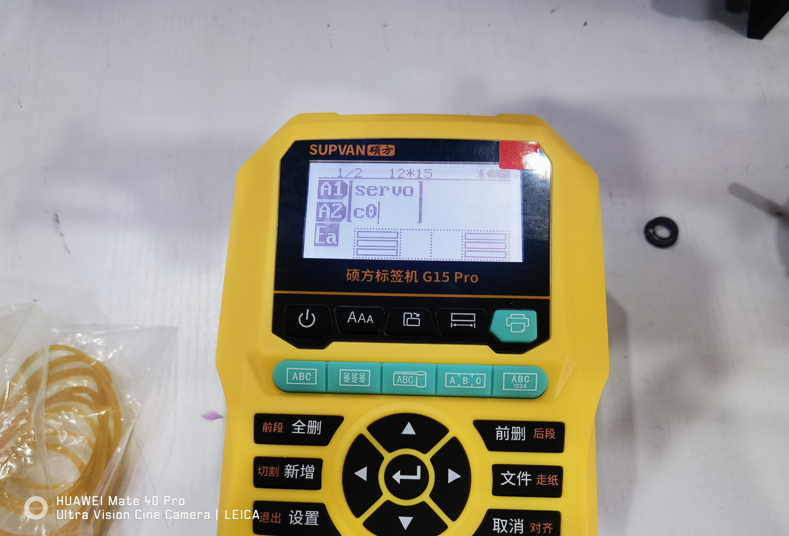

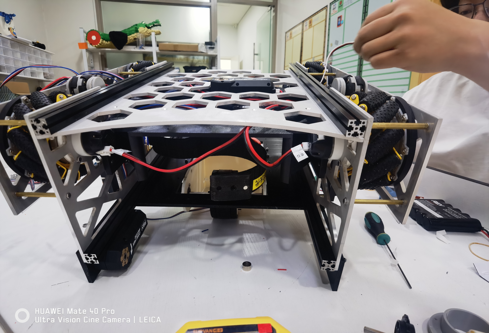

# 11.9

编完了所有的手动的程序，自学如何使用 git。

仓库：

可以通过远程上传的方式同步项目。

左轮的程序终于搞完了，把逻辑搞清楚了

```java
public class greenBallThread extends Thread {
    public void run() {
        try {
            servoUsing = false;
            strikerServoPosition = 0.49;  //一键下降
            robot.strikerServo.setPosition(strikerServoPosition);
            sleep(200);
            if (a == 2 && (colorLeft.equals("green") || colorRight.equals("green"))) {
                rotateMotorTargetPosition += 0;//(288/3);
            } else {
                if (a == 2) {
                    rotateMotorTargetPosition += step;//(288/3);
                }
                if (a == 1) {
                    rotateMotorTargetPosition += (step - 20);//(288/3);
                }
                while (opModeIsActive() && greenBallThreadUsing) {
                    rotateMotorCurrentPosition = robot.rotateMotor.getCurrentPosition();
                    rotateMotorPower = (rotateMotorTargetPosition - rotateMotorCurrentPosition) * 0.01;
                    if (0 < rotateMotorPower && rotateMotorPower <= rotateMotorMinPower) {
                        rotateMotorPower = rotateMotorMinPower;
                    }
                    if (rotateMotorPower < 0 && rotateMotorPower >= -rotateMotorMinPower) {
                        rotateMotorPower = -rotateMotorMinPower;
                    }

                    robot.rotateMotor.setPower(rotateMotorPower);

                    if (Math.abs(rotateMotorTargetPosition - rotateMotorCurrentPosition) <= 5 || rotateMotorCurrentPosition > rotateMotorTargetPosition - 5) {
                        rotateMotorPower = 0;
                        robot.rotateMotor.setPower(rotateMotorPower);
                        sleep(100);
                        if (colorLeft.equals("green") || colorRight.equals("green")) {
                            break;
                        } else {
                            rotateMotorTargetPosition += step;//(288/3);
                        }
                    }

                }
                rotateMotorPower = 0;
                robot.rotateMotor.setPower(rotateMotorPower);
            }
            a = 2;
            servoUsing = true;
        } catch (InterruptedException e) {
            throw new RuntimeException(e);
        }
    }
}
```

解释：

1.据变量 a 和当前左右颜色决定是否调整 rotateMotorTargetPosition（如果 a==2 且已有绿色则不移动，否则加上 step 或 step-20）。

2.进入循环 while (opModeIsActive() && greenBallThreadUsing)：

读取当前编码器 rotateMotorCurrentPosition；

计算 rotateMotorPower = (target - current) * 0.01，并强制最小绝对功率为 rotateMotorMinPower（避免死转力矩过小）；

将功率写入 robot.rotateMotor。

3.

当靠近目标（差值 <= 5 或当前 > target - 5）时：把电机停下、sleep(100)，如果检测到左右任一为绿色则退出循环，否则把 rotateMotorTargetPosition += step 继续下一段搜索。

4.退出循环后确保电机停 (power=0)，把 a = 2，恢复 servoUsing = true。

开启逻辑：

```java
if (gamepad2.left_bumper) {
    purpleBallThreadUsing = false;
    inBallPrepareThreadUsing = false;
    while (gamepad2.left_bumper) {
        if (!gamepad2.left_bumper) {
            break;
        }
    }
    greenBallThread.start();
    purpleBallThreadUsing = true;
    inBallPrepareThreadUsing = true;
}
```

解释：

检测到 gamepad2.left_bumper 被按下后，先把 purpleBallThreadUsing 和 inBallPrepareThreadUsing 设为 false，请求其它线程停止工作。

while (gamepad2.left_bumper) { ... } 这段是等待按键释放的循环；它会在按键保持按下时一直空转（忙等待），直到释放才继续。

释放后调用 greenBallThread.start() 启动绿色球处理线程，随后再次将 purpleBallThreadUsing 和 inBallPrepareThreadUsing 设为 true（恢复标志）。

# 11.15-16

我也不知道干啥了，总之车能跑了，应该是测试了飞轮的速度，利用转速控制。发现两个问题。一，在自己写的线程中直接.get 马达转速会导致线程堵塞，占用 CPU 和内存，导致手柄延迟上升。二，单个电机最高转速（实际）为 4300 刻度/分钟。有点慢，估计要两个马达。所以耗电量巨大，平均一场比赛下来就要换一次电。吐槽：内个左轮转盘幻想着有多好用，实际上就是一坨打的。

# 12.14

今天上课！写了一点点程序就。找到了可以在手动阶段确定自己的位置的程序：

```java
MecanumDrive drive = new MecanumDrive(hardwareMap, new Pose2d(0, 0, 0));
Pose2d currentPose = drive.localizer.getPose();

// 提取坐标和角度
double x = currentPose.position.x;        // X坐标（英寸）
double y = currentPose.position.y;        // Y坐标（英寸）
double heading = currentPose.heading.toDouble(); // 方位角（弧度）

// 转换为角度
double headingDegrees = Math.toDegrees(heading);
telemetry.addData("x", x);
telemetry.addData("y", y);
telemetry.addData("heading (deg)", headingDegrees);
telemetry.update();

Pose2d pose = drive.localizer.getPose();
TelemetryPacket packet = new TelemetryPacket();
packet.fieldOverlay().setStroke("#3F51B5");
Drawing.drawRobot(packet.fieldOverlay(), pose);
FtcDashboard.getInstance().sendTelemetryPacket(packet);
```

这个代码借助借助 org.firstinspires.ftc.teamcode.MecanumDrive;所以要 import 一下。

我看了一下 LED 灯的编写方法

```java
package org.firstinspires.ftc.teamcode.FTC_27650_Test;
/*
        Copyright (c) 2021-24 Alan Smith

        All rights reserved.

        Redistribution and use in source and binary forms, with or without modification,
        are permitted (subject to the limitations in the disclaimer below) provided that
        the following conditions are met:

        Redistributions of source code must retain the above copyright notice, this list
        of conditions and the following disclaimer.

        Redistributions in binary form must reproduce the above copyright notice, this
        list of conditions and the following disclaimer in the documentation and/or
        other materials provided with the distribution.

        Neither the name of Alan Smith nor the names of its contributors may be used to
        endorse or promote products derived from this software without specific prior
        written permission.

        NO EXPRESS OR IMPLIED LICENSES TO ANY PARTY'S PATENT RIGHTS ARE GRANTED BY THIS
        LICENSE. THIS SOFTWARE IS PROVIDED BY THE COPYRIGHT HOLDERS AND CONTRIBUTORS
        "AS IS" AND ANY EXPRESS OR IMPLIED WARRANTIES, INCLUDING, BUT NOT LIMITED TO,
        THE IMPLIED WARRANTIES OF MERCHANTABILITY AND FITNESSFOR A PARTICULAR PURPOSE
        ARE DISCLAIMED. IN NO EVENT SHALL THE COPYRIGHT OWNER OR CONTRIBUTORS BE LIABLE
        FOR ANY DIRECT, INDIRECT, INCIDENTAL, SPECIAL, EXEMPLARY, OR CONSEQUENTIAL
        DAMAGES (INCLUDING, BUT NOT LIMITED TO, PROCUREMENT OF SUBSTITUTE GOODS OR
        SERVICES; LOSS OF USE, DATA, OR PROFITS; OR BUSINESS INTERRUPTION) HOWEVER
        CAUSED AND ON ANY THEORY OF LIABILITY, WHETHER IN CONTRACT, STRICT LIABILITY, OR
        TORT (INCLUDING NEGLIGENCE OR OTHERWISE) ARISING IN ANY WAY OUT OF THE USE OF
        THIS SOFTWARE, EVEN IF ADVISED OF THE POSSIBILITY OF SUCH DAMAGE.
*/

import android.graphics.Color;

import com.qualcomm.hardware.sparkfun.SparkFunLEDStick;
import com.qualcomm.robotcore.eventloop.opmode.Disabled;
import com.qualcomm.robotcore.eventloop.opmode.OpMode;
import com.qualcomm.robotcore.eventloop.opmode.TeleOp;
import com.qualcomm.robotcore.util.Range;

/*
 * This OpMode illustrates how to use the SparkFun QWIIC LED Strip
 *
 * This is a simple way to add a strip of 10 LEDs to your robot where you can set the color of each
 * LED or the whole strip.   This allows for driver feedback or even just fun ways to show your team
 * colors.
 *
 * Why?
 * Because more LEDs == more fun!!
 *
 * This OpMode assumes that the QWIIC LED Stick is attached to an I2C interface named "back_leds" in the robot configuration.
 *
 * Use Android Studio to Copy this Class, and Paste it into your team's code folder with a new name.
 * Remove or comment out the @Disabled line to add this OpMode to the Driver Station OpMode list
 *
 * You can buy this product here:  https://www.sparkfun.com/products/18354
 * Don't forget to also buy this to make it easy to connect to your Control or Expansion Hub:
 * https://www.sparkfun.com/products/25596
 */
@TeleOp(name = "Concept: LED Stick", group = "Concept")

public class ConceptLEDStick extends OpMode {
    private boolean wasUp;
    private boolean wasDown;
    private int brightness = 5;  // this needs to be between 0 and 31
    private final static double END_GAME_TIME = 120 - 30;

    private SparkFunLEDStick ledStick;

    @Override
    public void init() {
        ledStick = hardwareMap.get(SparkFunLEDStick.class, "back_leds");
        ledStick.setBrightness(brightness);
        ledStick.setColor(Color.GREEN);
    }

    @Override
    public void start() {
        resetRuntime();
    }

    @Override
    public void loop() {
        telemetry.addLine("Hold the A button to turn blue");
        telemetry.addLine("Hold the B button to turn red");
        telemetry.addLine("Hold the left bumper to turn off");
        telemetry.addLine("Use DPAD Up/Down to change brightness");
        
        if (getRuntime() > END_GAME_TIME) {
            int[] ledColors = {Color.RED, Color.YELLOW, Color.RED, Color.YELLOW, Color.RED,
                    Color.YELLOW, Color.RED, Color.YELLOW, Color.RED, Color.YELLOW};
            ledStick.setColors(ledColors);
        } else if (gamepad1.a) {
            ledStick.setColor(Color.BLUE);
        } else if (gamepad1.b) {
            ledStick.setColor(Color.RED);
        } else if (gamepad1.left_bumper) {
            ledStick.turnAllOff();
        } else {
            ledStick.setColor(Color.GREEN);
        }

        /*
         * Use DPAD up and down to change brightness
         */
        int newBrightness = brightness;
        if (gamepad1.dpad_up && !wasUp) {
            newBrightness = brightness + 1;
        } else if (gamepad1.dpad_down && !wasDown) {
            newBrightness = brightness - 1;
        }
        if (newBrightness != brightness) {
            brightness = Range.clip(newBrightness, 0, 31);
            ledStick.setBrightness(brightness);
        }
        telemetry.addData("Brightness", brightness);

        wasDown = gamepad1.dpad_down;
        wasUp = gamepad1.dpad_up;
    }
}
```

对于我来说还是很简单的。

把车要改进 的地方都搭好了，下节课就能跑了。

上节课的内容：使用 limelight

```java
package org.firstinspires.ftc.teamcode.FTC_27650_Test;

import com.acmerobotics.dashboard.config.Config;
import com.qualcomm.hardware.limelightvision.LLResult;
import com.qualcomm.hardware.limelightvision.LLResultTypes;
import com.qualcomm.hardware.limelightvision.Limelight3A;
import com.qualcomm.robotcore.eventloop.opmode.LinearOpMode;
import com.qualcomm.robotcore.eventloop.opmode.TeleOp;

import java.util.List;

@TeleOp(name = "limelight", group = "limelight")
@Config
public class limelight extends LinearOpMode {
    public static double limelightMountAngleDegrees = 0; // 您的limelight从完全垂直方向向后旋转了多少度？
    public static double limelightLensHeightInches = 6.1; // Limelight镜头中心到地面的距离
    public static double goalHeightInches = 29.33071;// 目标到地面的距离

    @Override

    public void runOpMode() throws InterruptedException {
        Limelight3A limelight;
        limelight = hardwareMap.get(Limelight3A.class, "limelight");
        limelight.setPollRateHz(90); // 这设置了我们向Limelight请求数据的频率（每秒90次）
        limelight.pipelineSwitch(0); // 切换到管道编号0


        waitForStart();
        while (opModeIsActive()) {
            limelight.start(); // 这告诉Limelight开始观察！
            LLResult result = limelight.getLatestResult();
            if (result != null && result.isValid()) {
                double tx = result.getTx(); // 目标在左右方向上的偏移（度）
                double ty = result.getTy(); // 目标在上下方向上的偏移（度）
                double ta = result.getTa(); // 目标看起来有多大（图像的0%-100%）

                telemetry.addData("目标 X", tx);
                telemetry.addData("目标 Y", ty);
                telemetry.addData("目标大小", ta);
                List<LLResultTypes.FiducialResult> fiducialResults = result.getFiducialResults();
                for (LLResultTypes.FiducialResult fr : fiducialResults) {
                    telemetry.addData("Fiducial", "ID: %d, Family: %s, X: %.2f, Y: %.2f", fr.getFiducialId(), fr.getFamily(), fr.getTargetXDegrees(), fr.getTargetYDegrees());
                }

                // Estimating_Distance（估算距离）方法的使用示例
                // 你需要提供实际的安装角度和高度

                double distance = Estimating_Distance(ty, limelightMountAngleDegrees, limelightLensHeightInches, goalHeightInches);
                telemetry.addData("Estimated Distance", distance);

            } else {
                telemetry.addData("Limelight", "没有目标");
            }
            telemetry.update();
        }
    }

    public double Estimating_Distance(double targetOffsetAngle_Vertical, double limelightMountAngleDegrees, double limelightLensHeightInches, double goalHeightInches) {
        // NetworkTables 代码已被移除，因为它是为 FRC 设计的，不适用于 FTC。
        // 我们直接使用传入的 targetOffsetAngle_Vertical (ty)。

        double angleToGoalDegrees = limelightMountAngleDegrees + targetOffsetAngle_Vertical;
        double angleToGoalRadians = angleToGoalDegrees * (Math.PI / 180.0);

        //计算距离

        // 必须返回计算出的值
        return (goalHeightInches - limelightLensHeightInches) / Math.tan(angleToGoalRadians);
    }

}
```

借助 AI，现在可以在 FTC 的包里使用 limelight 测距了。具体的内容都在注释里。

详情见 github:[https://github.com/xingshanze12-oss/road-runner-quickstart-master_27650](https://github.com/xingshanze12-oss/road-runner-quickstart-master_27650)

## 放几张美图在这里

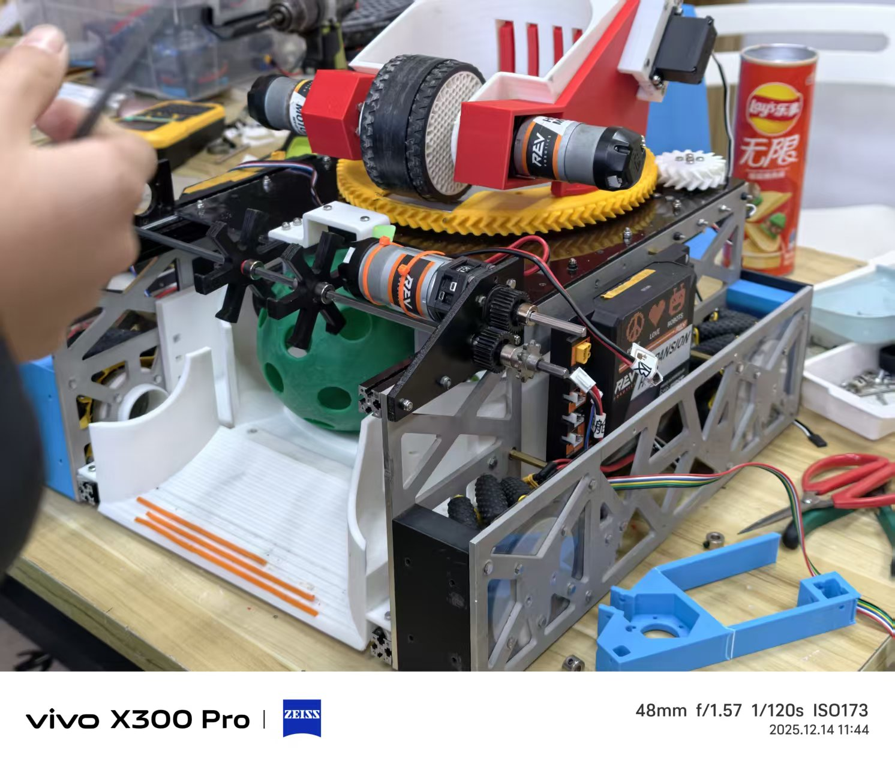

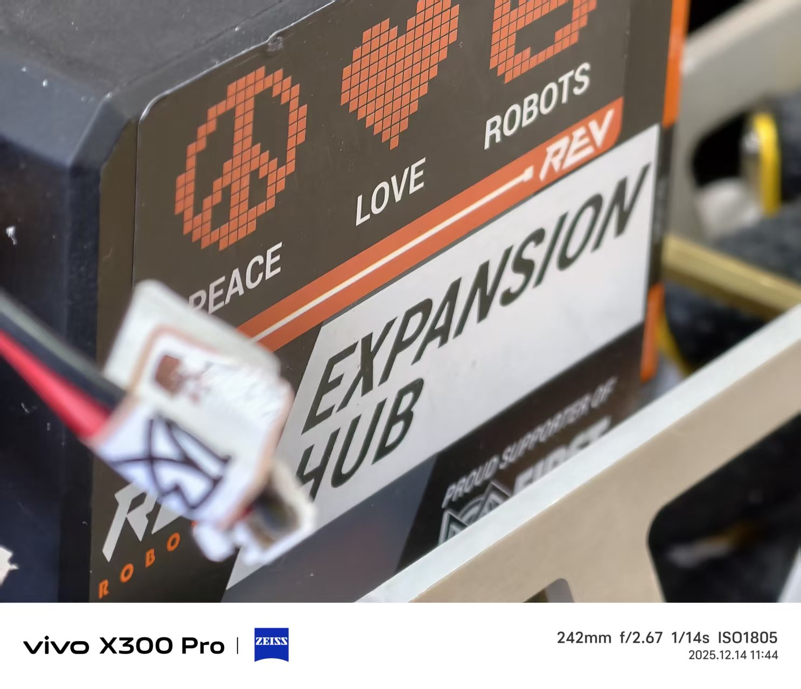

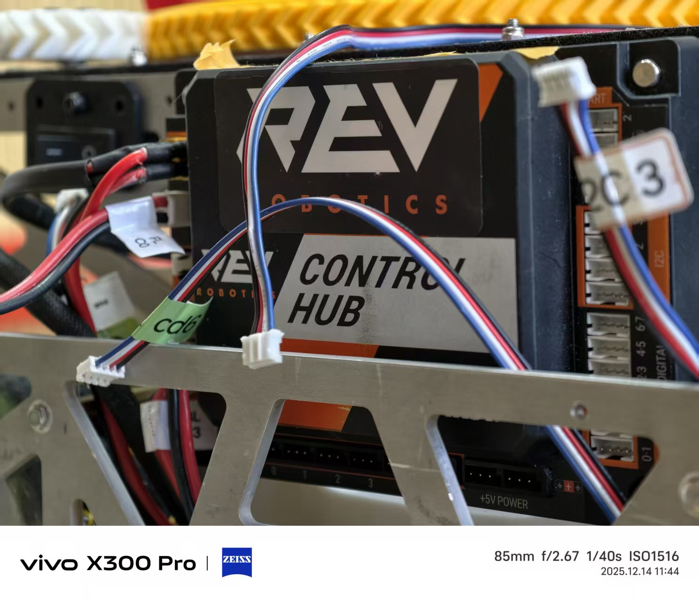

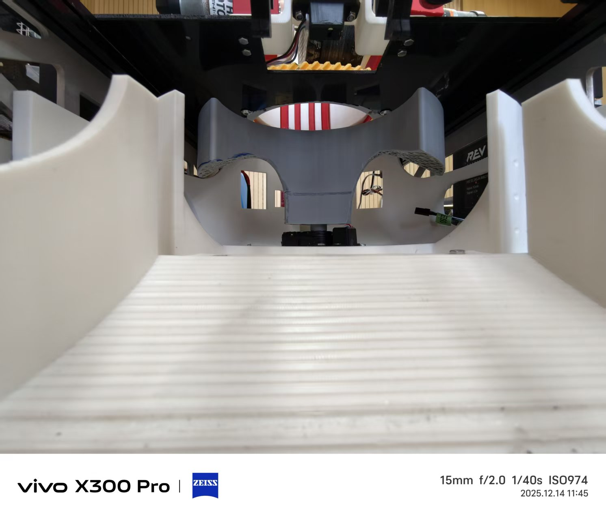

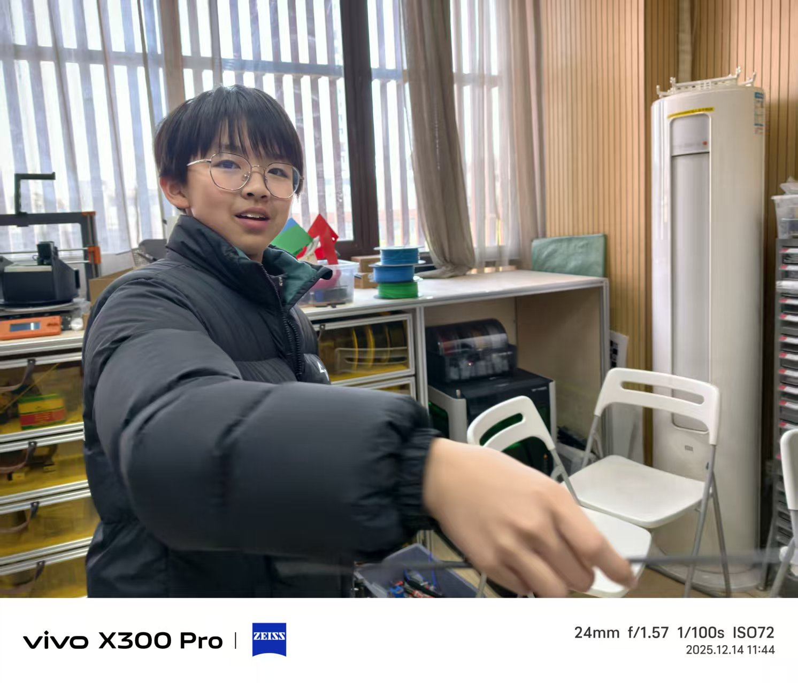


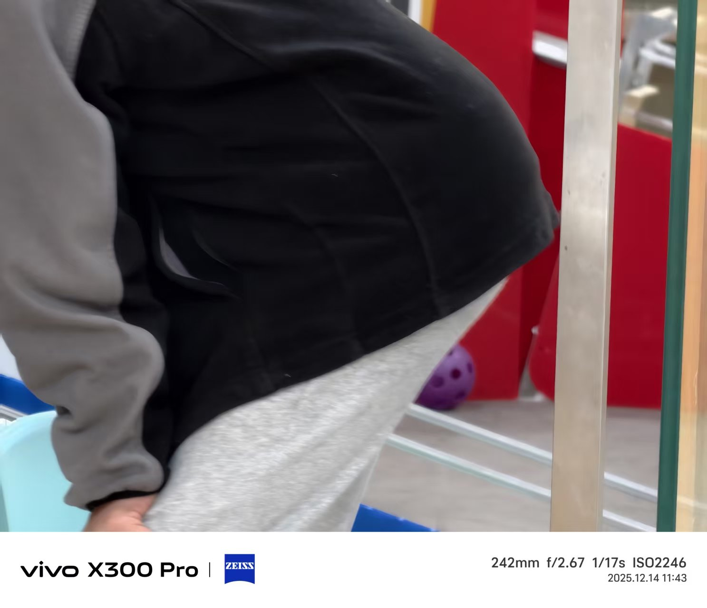

就这些。。。。。。

# 12.21

#
